# 📌 Tennis Scoreboard Display  
A project showcasing the development of a tennis scoreboard and its Application.
This project involved creating a functional tennis scoreboard display. The images above document the assembly, wiring, and final result.

- 🛠️ **Technologies Used**: (ESP32, software designed in C++ AND Javascript, hardware and PCB Design in EasyEDA)
- ⚡ **Features**: A User-friendly Application for both iOS and Android that controls the Display.
---

## 🖼️ Project Images

Here is a visual of the final product:

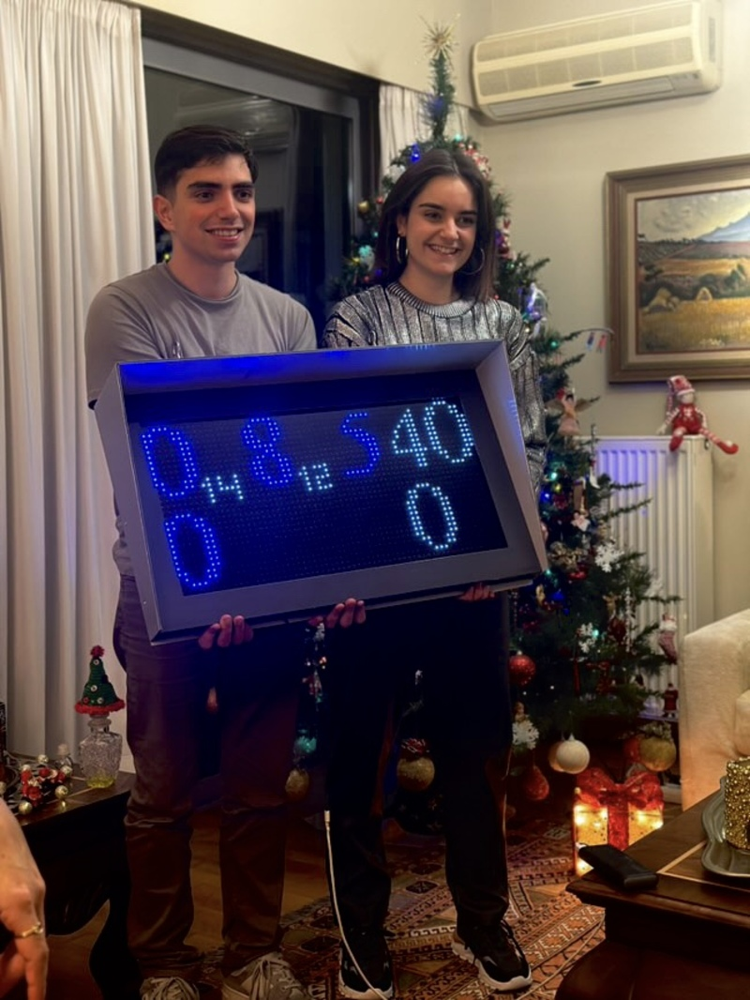 || [Tennis app](images/Tennis_app.gif)

### Development Process
| | |
|---|---|
| 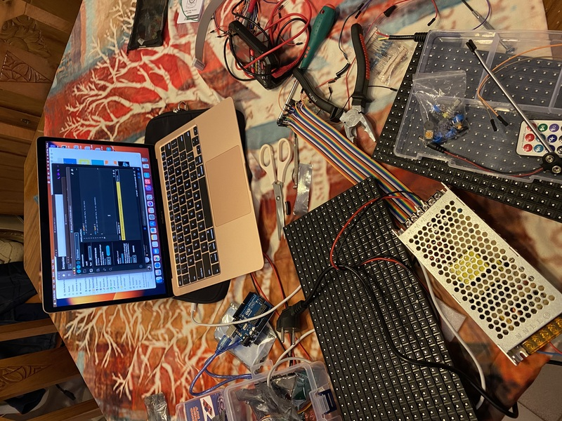 | 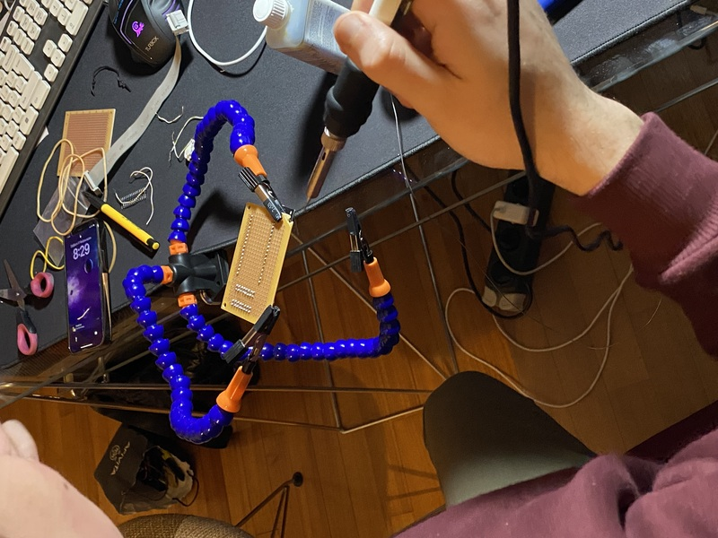 |
| 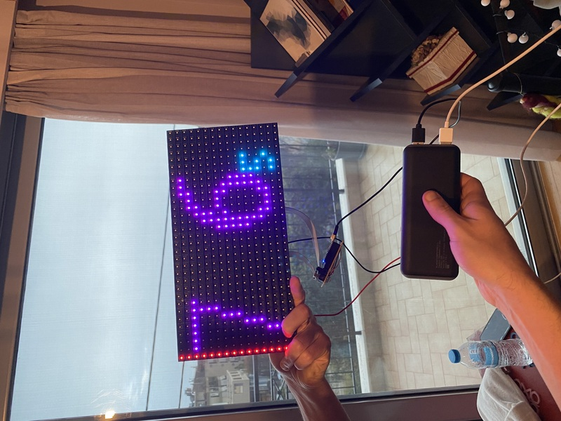 | 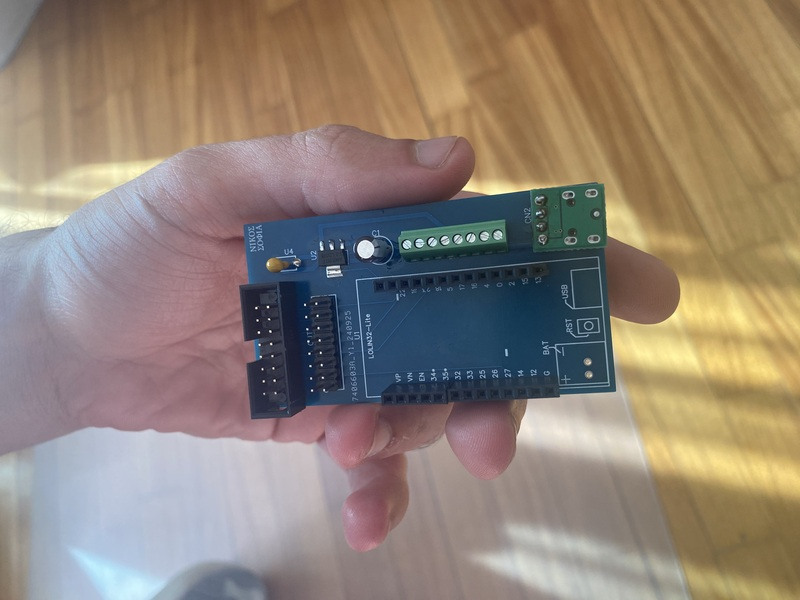 |
| 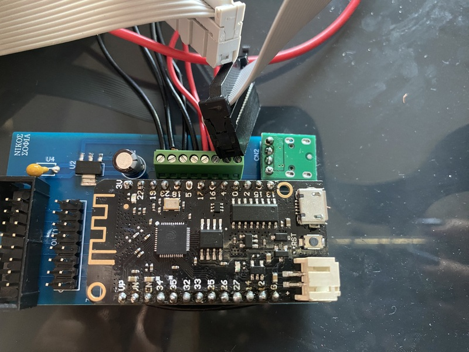 | 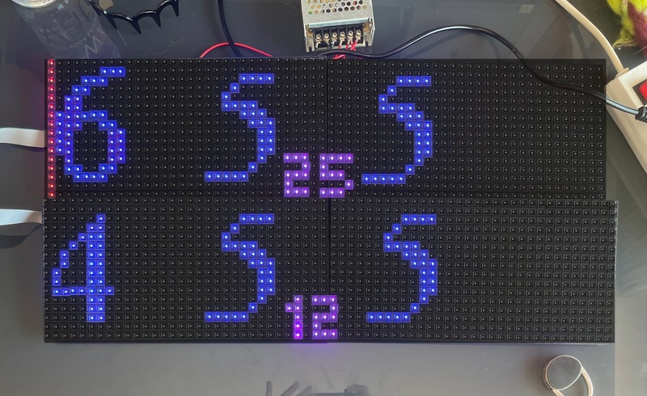 |
| 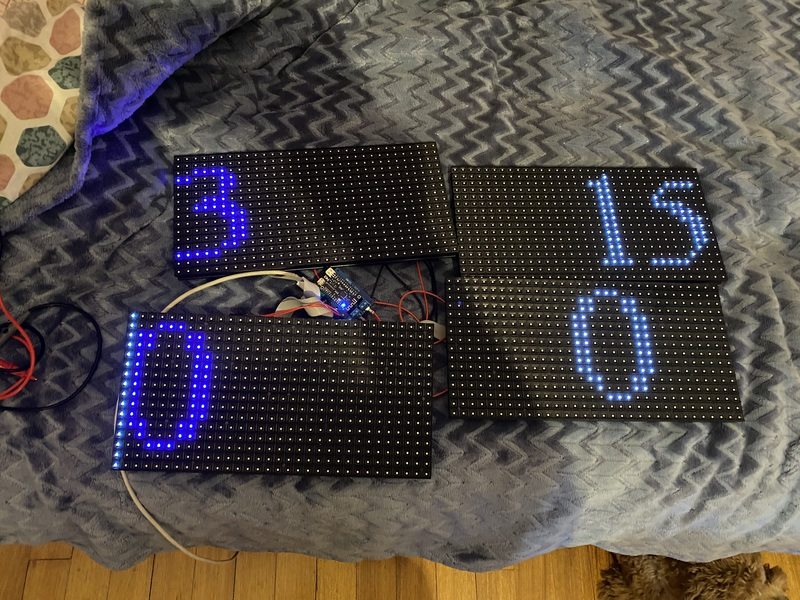 | 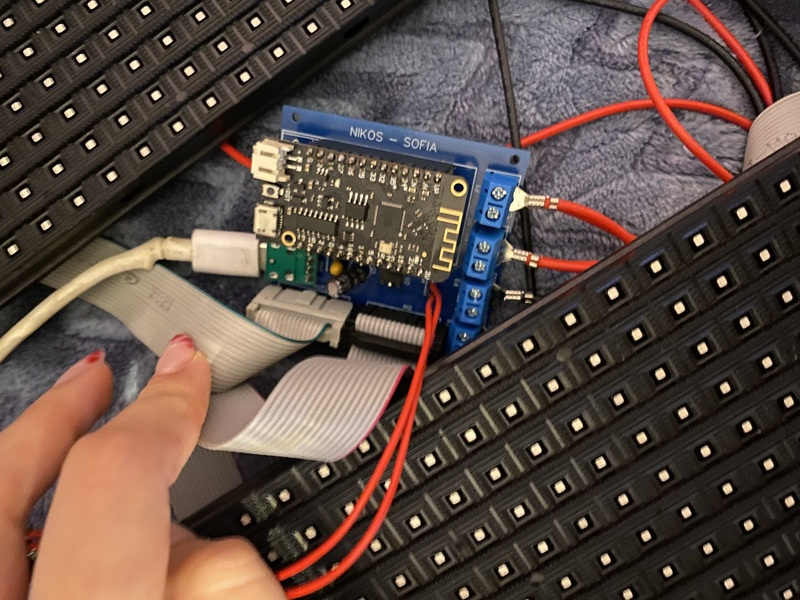 |
| 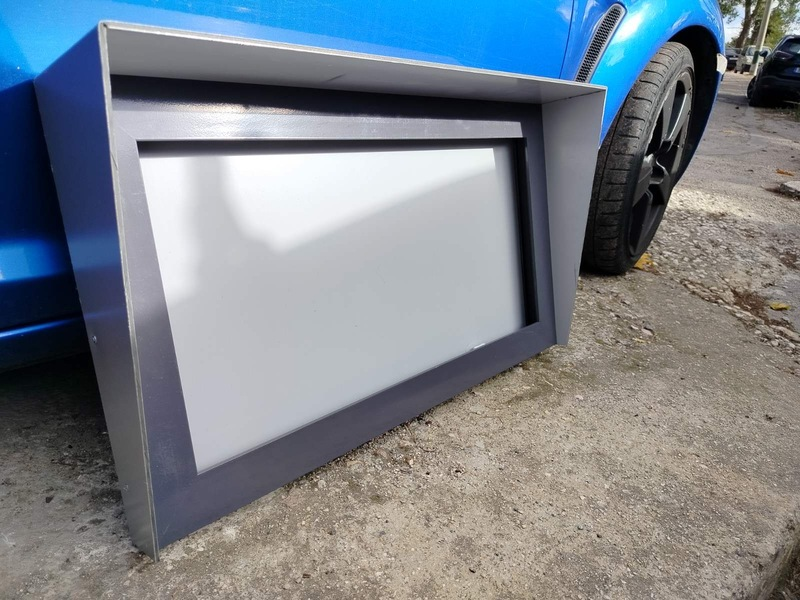 | 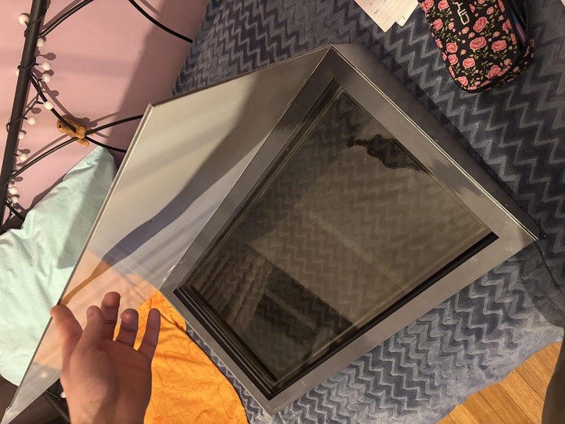 |
| 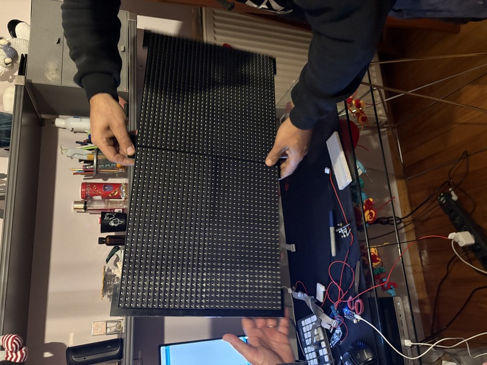 | 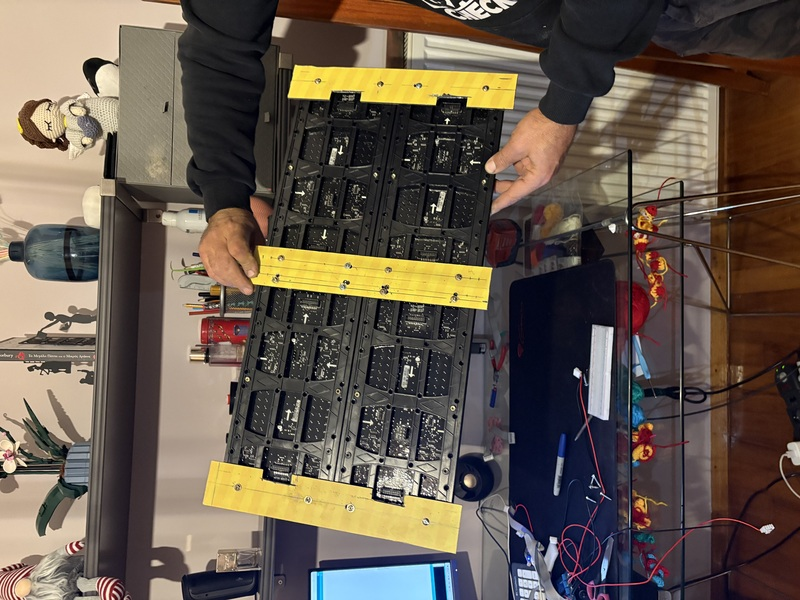 |
| 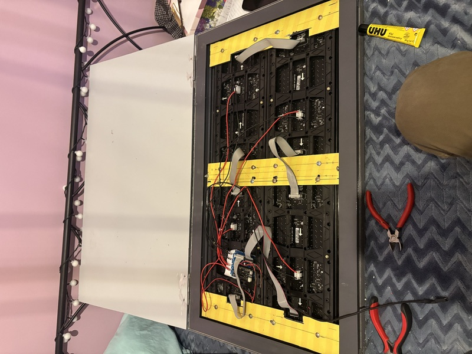 | 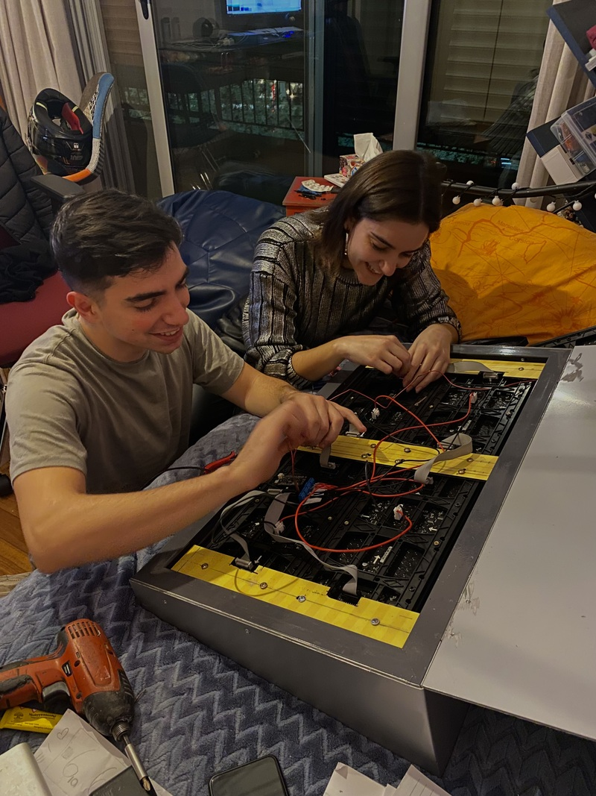 |
| 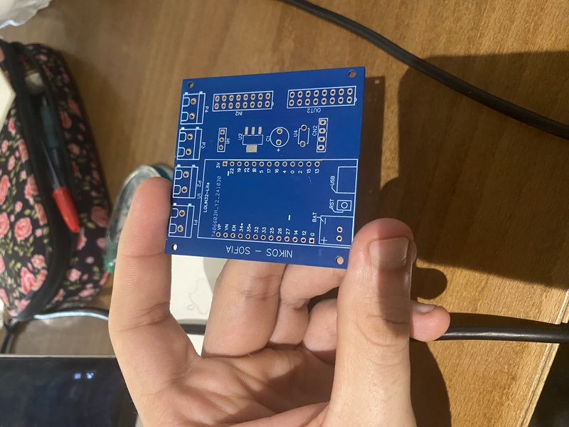 |  |

