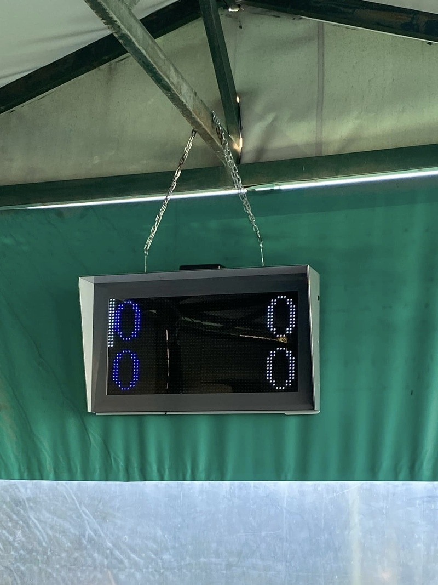

# 📌 Tennis Scoreboard Display  
A project showcasing the development of a tennis scoreboard for outdoor usage.
This project involved creating both hardware and software. The images above document the assembly, wiring, and final result.

- 🛠️ **Technologies Used**: (ESP32, software designed in C++ AND Javascript, hardware and PCB Design in EasyEDA)
- ⚡ **Features**: A User-friendly Application for both iOS and Android devices that controls the Display.
---

## 🖼️ Project Images

Here is a visual of the final product:

  
  

### Development Process

<table>
  <tr>
    <td></td>
    <td></td>
  </tr>
  <tr>
    <td></td>
    <td></td>
  </tr>
  <tr>
    <td></td>
    <td></td>
  </tr>
  <tr>
    <td></td>
    <td></td>
  </tr>
  <tr>
    <td></td>
    <td></td>
  </tr>
  <tr>
    <td></td>
    <td></td>
  </tr>
  <tr>
    <td></td>
    <td></td>
  </tr>
  <tr>
    <td></td>
    <td></td>
  </tr>
</table>

